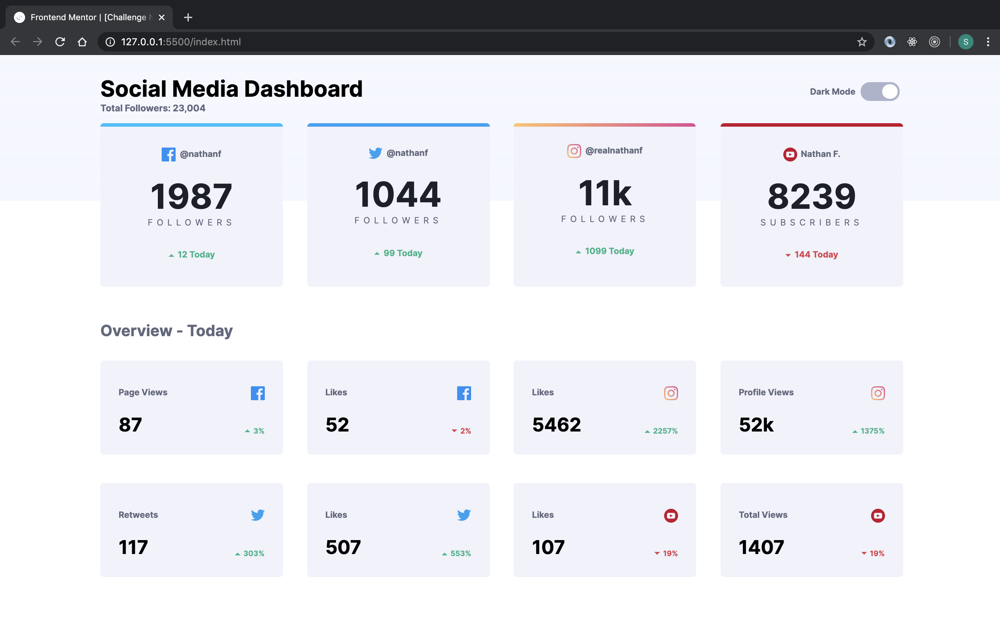
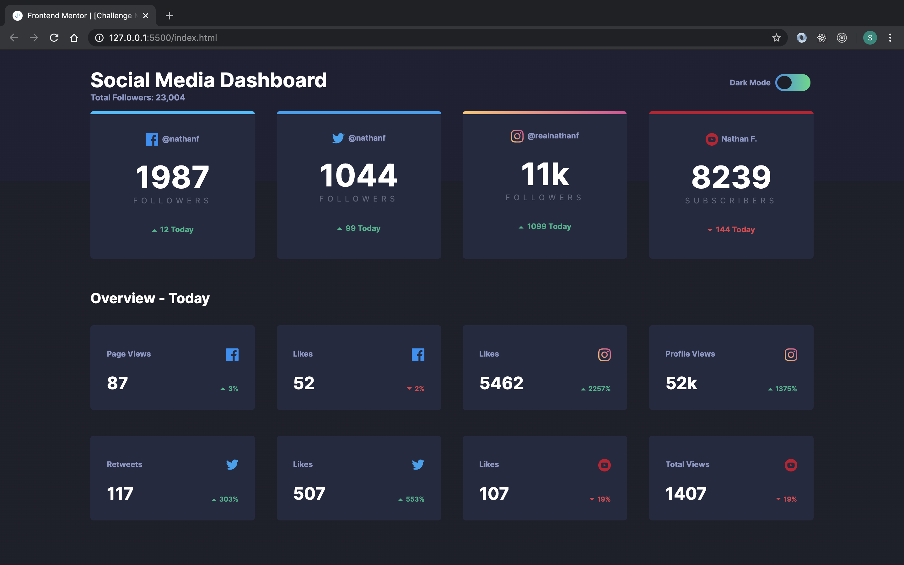
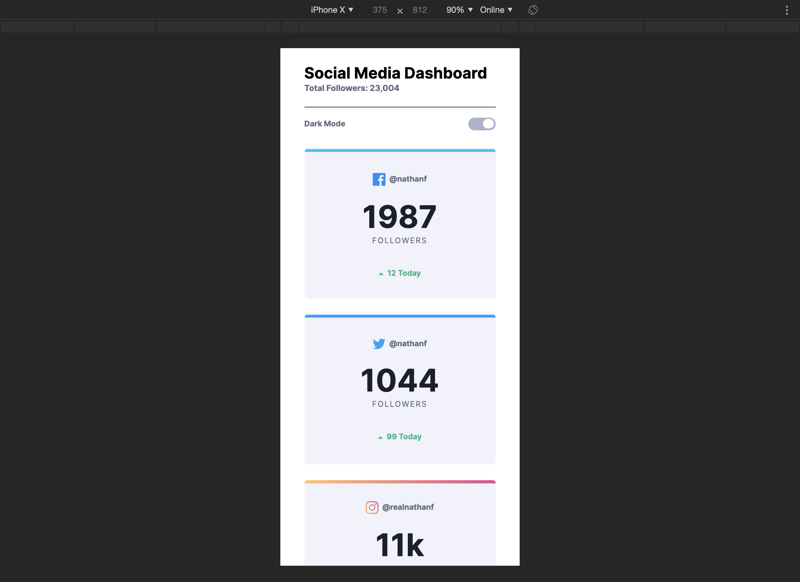
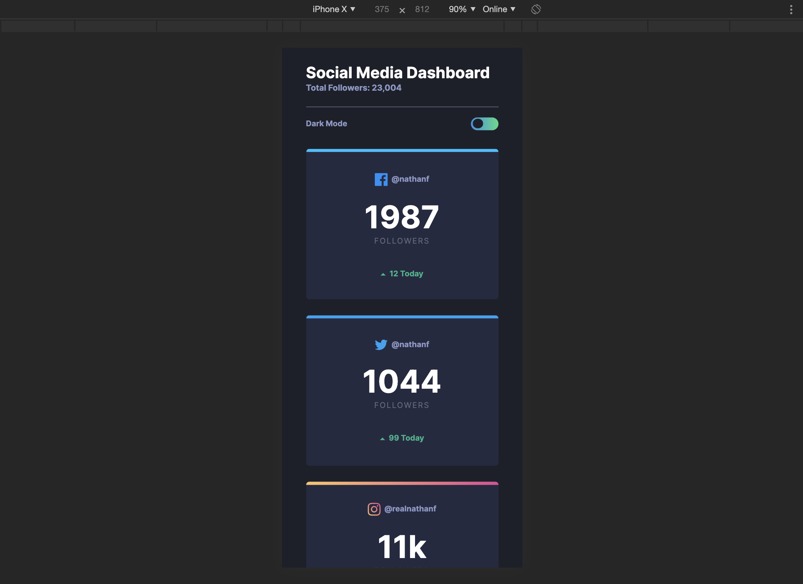

# Frontend Practice - Social Media Dashboard

Practicing front end skills by completing a Social Media Dashboard project provided by Frontend Mentor. 

[Frontend Mentor](https://www.frontendmentor.io) challenges allow you to improve your skills in a real-life workflow.

Desktop Light Mode:

Desktop Dark Mode:

Mobile Light Mode:

Mobile Dark mode:

Project was created using HTML/CSS, SASS, and JavaScript. No outside libraries.